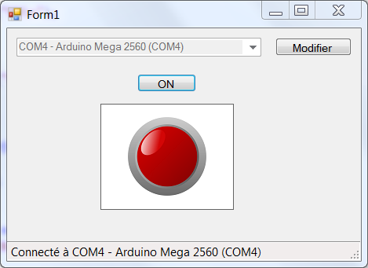

# ArduinoToVisualStudio
## Connexion automatique d'une Arduino avec VisualStudio C# ##

Ce programme permet de piloter la LED connectée sur D13 sur une Arduino (uno, mega, ...).

Les mots de commandes disponibles sont :

* ON     : Allumer la LED
* OFF    : Eteindre la LED
* STATUS : Demande le status de la LED

Le code Arduino s'appui sur l'utilisation de la méthode readStringUntil() de l'objet Serial :

```c
ordre = Serial.readStringUntil('\n');
      
if(ordre=="ON")  
{
	...
}
if(ordre=="OFF") 
{
    ...
}
if(ordre=="STATUS")
{
      ... 
}
```

Le code C# utilise la classe ManagementObjectSearcher qui permet de rechercher une ressource précise au sein du système. Ici, on cherche les ports séries et leur description. On se connectera ensuite  à celui dont la description contion le mot "Arduino".

* Espaces de nom à ajouter :

```c
	using System.Management;
	using System.IO.Ports; 
```

* Référence à ajouter au projet (Explorateur de solutions -> Références):

```c
	System.Management
```

* Au chargement du formulaire, 
   * rechercher les ports séries,
   * rechercher le port de connexion de l'Arduino
   * tenter de s'y connecter
   * gérer les erreurs de connexion

```c
		private void Form1_Load(object sender, EventArgs e)
        {
            string arduinoLine="";
            string arduPort="";
            int arduinoItem = -1;
            using (var searcher = new ManagementObjectSearcher("SELECT * FROM WIN32_SerialPort"))
            {
                string[] portnames = SerialPort.GetPortNames();
                var ports = searcher.Get().Cast<ManagementBaseObject>().ToList();
                var tList = (from n in portnames
                             join p in ports on n equals p["DeviceID"].ToString()
                             select n + " - " + p["Caption"]).ToList();
                
                foreach (string s in tList)
                {
                    comboBox1.Items.Add(s);
                    if (s.Contains("Arduino")) 
                    {
                        arduinoLine = s;
                        arduinoItem = comboBox1.Items.IndexOf(s);
                        arduPort = s.Substring(0,5).Replace(" ",string.Empty);
                    }
                }
                if (arduinoItem > -1)
                {
                    comboBox1.SelectedIndex = arduinoItem;
                    serialPort1.PortName = arduPort;
                    try
                    {
                        serialPort1.Open();
                        toolStripStatusLabel1.Text = "Connecté à " + arduinoLine;
                        comboBox1.Enabled = false;
                        timer1.Enabled = true;
                        serialPort1.Write("STATUS\n");
                    }
                    catch
                    {
                        DialogResult result;
                        result = MessageBox.Show("Impossible d'ouvrir le port " + serialPort1.PortName + " !\n" +
                                                 "Ce port est peut être déja ouvert.\n" +
                                                 "Voulez-vous recommencé ?" 
                                                 , "Erreur !", MessageBoxButtons.YesNo, MessageBoxIcon.Error);
                        if (result == DialogResult.Yes) Application.Restart();
                        else Application.Exit();
                    }
                }
                else
                {
                    DialogResult result;
                    result=MessageBox.Show("Pas de carte Arduino détectée !\nConnectez une Arduino maintenant.", "Erreur !", MessageBoxButtons.OKCancel, MessageBoxIcon.Error);
                    if (result == DialogResult.OK) Application.Restart();
                    else Application.Exit();
                }
                
            } 
        }
```




